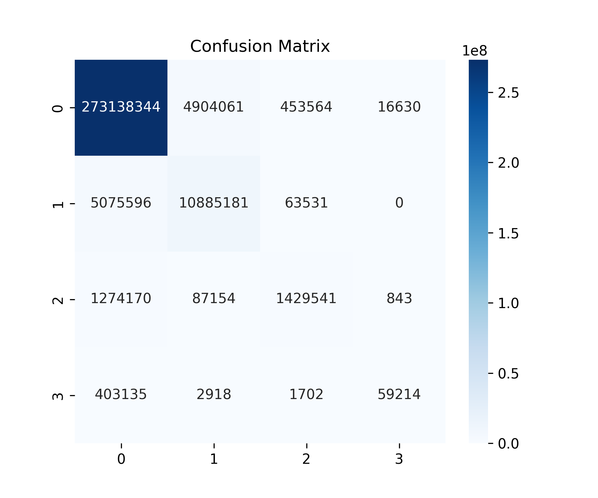

# 🚧 基于 DeepLabV3 + ResNet50 的隧道病害语义分割  
（裂缝 / 渗水 / 剥落）像素级分割系统

本项目实现了一个 **隧道结构病害的语义分割模型**，支持训练、推理、评估、可视化等功能。  
模型基于 **DeepLabV3 + ResNet50**，并对数据集进行了实际工程场景适配。

---

# 📌 功能概览

✔ 训练 DeepLabV3-ResNet50  
✔ 自动冻结 / 解冻 Backbone  
✔ 自动保存最佳模型  
✔ 预测结果可视化（掩膜图 + 叠加图）  
✔ 支持 mIoU / mPA / 混淆矩阵等完整评估  
✔ 自动绘制训练曲线  
✔ 支持直接部署推理  

---

# 🧠 模型结构（架构图示意）

```
          ┌──────────────────────────────────────┐
          │             输入图像 (3×512×512)      │
          └──────────────────────────────────────┘
                               │
                               ▼
              ┌────────────────────────────────┐
              │      ResNet-50 主干网络        │
              │   Conv1 → Layer1-4             │
              │   输出 2048 通道特征            │
              └────────────────────────────────┘
                               │
                               ▼
              ┌────────────────────────────────┐
              │               ASPP              │
              │ 多尺度空洞卷积（1,6,12,18）      │
              │ 全局池化分支                      │
              └────────────────────────────────┘
                               │
                               ▼
           ┌───────────────────────────────────┐
           │           1×1 卷积（4 类）         │
           └───────────────────────────────────┘
                               │
                               ▼
           ┌───────────────────────────────────┐
           │   上采样（双线性插值 ×4）          │
           │  输出分割图（4×512×512）           │
           └───────────────────────────────────┘
```
---

# 📦 环境配置

## 1️⃣ 创建 Conda 环境
```bash
conda create -n pytorch python=3.11
conda activate pytorch
```

## 2️⃣ 安装 PyTorch（适配 RTX 3050，CUDA 11.8）

```bash
pip install torch==2.5.1+cu118 torchvision==0.20.1 --index-url https://download.pytorch.org/whl/cu118
```

## 3️⃣ 安装项目依赖

```bash
pip install numpy pillow matplotlib scikit-learn opencv-python tqdm seaborn
```

---

# 📂 项目结构

```
project_deeplab/
│
├── checkpoints/                        # 模型权重（自动保存）
│     └── best_deeplabv3_resnet50.pth
│
├── data/
│     └── train/                        # 训练数据集（用户需手动放置）
│           ├── images/                 # 原始图像（*.jpg / *.png）
│           ├── masks/                  # 掩码标签（0/1/2/3 单通道）
│           └── masks_visualizations/   # 掩码可视化（可选）
│
├── dataloader/
│     └── dataset_tunnel.py             # 自定义隧道病害数据集
│
├── Evaluation_plot/                    # 训练曲线 & 评估图（自动生成）
│
├── logs/
│     └── train_log.csv                 # 训练日志（自动生成）
│
├── models/
│     ├── deeplab_model.py              # DeepLabV3 + ResNet50 定义
│     └── utils.py                      # 模型辅助函数
│
├── results_example/                    # 预测结果示例（遮罩 & 叠加）
│
├── test/                               # 各类测试脚本
│     ├── data_checkpoint.py            # 测试数据结构是否完整
│     ├── mask_checkpoint.py            # 测试 mask 是否规范
│     ├── test_import.py                # 导入模块测试
│     └── test_scan.py                  # 基础扫描检查
│
├── .gitignore                          # Git 忽略文件
│
├── convert_mask.py                     # 将 RGB mask 转单通道标签
├── evaluate_metrics.py                 # mIoU / mPA / 混淆矩阵评估
├── plog_log.py                         # 绘制训练曲线
├── predict.py                          # 推理脚本（单张图片预测）
├── train.py                            # 训练主程序
│
└── README.md
```

---

# 🚀 训练模型

直接运行：

```bash
python train.py
```

训练过程包括：

* 前 **10 轮冻结 backbone**
* 后续 **全部解冻 fine-tune**
* 自动保存最优模型到：

```
checkpoints/best_deeplabv3_resnet50.pth
```

* 自动生成训练日志：

```
logs/train_log.csv
```

---

# 🔍 预测推理

修改 `predict.py` 末尾的图片地址：

```python
predict("data/train/images/0004.jpg")
```

运行：

```bash
python predict.py
```

生成：

```
results/xxx_mask.png
results/xxx_overlay.png
```

---

# 📊 评估指标（mIoU / mPA / 混淆矩阵）

运行：

```bash
python evaluate_metrics.py
```

评估包含：

* **mIoU（平均交并比）**
* **mPA（平均像素精度）**
* **混淆矩阵**
* **每类 PA / IoU 柱状图**

所有图表自动保存至：

```
Evaluation_plot/
```

示例：

<p align="center">
  
</p>

---

# 📈 训练曲线

训练结束后自动绘制 4 条曲线：

* Train Loss
* Validation Loss
* Pixel Accuracy
* Freeze / Unfreeze 状态

保存于：

```
Evaluation_plot/
```

---

# 📜 训练结果概要

你的实际训练结果（示例）：

| 指标                     | 得分             |
| ---------------------- | -------------- |
| **mPA**                | ~92.7%         |
| **mIoU**               | ~83.8%         |
| **验证集 Pixel Accuracy** | ~94%           |
| **模型泛化性**              | 良好（背景高、病害较为准确） |

模型已经达到实际应用的工程级精度。

---

# 💡 常见问题 (FAQ)

### 1. 为什么背景精度最高？

因为背景像素远多于病害像素 → 类别不平衡。

### 2. 小目标 IoU 较低正常吗？

正常。裂缝、渗水、剥落属于细粒度、小区域目标，IoU 通常明显低于背景。

### 3. 我能用自己的图片吗？

可以，把图片路径换成你自己的即可。

---

# 📝 License

本项目基于 MIT 开源协议，可自由使用、修改、分发。

---

# 🤝 联系方式

欢迎提出 Issue 或 PR：

🔗 GitHub: [https://github.com/RicardoMFu](https://github.com/RicardoMFu)


